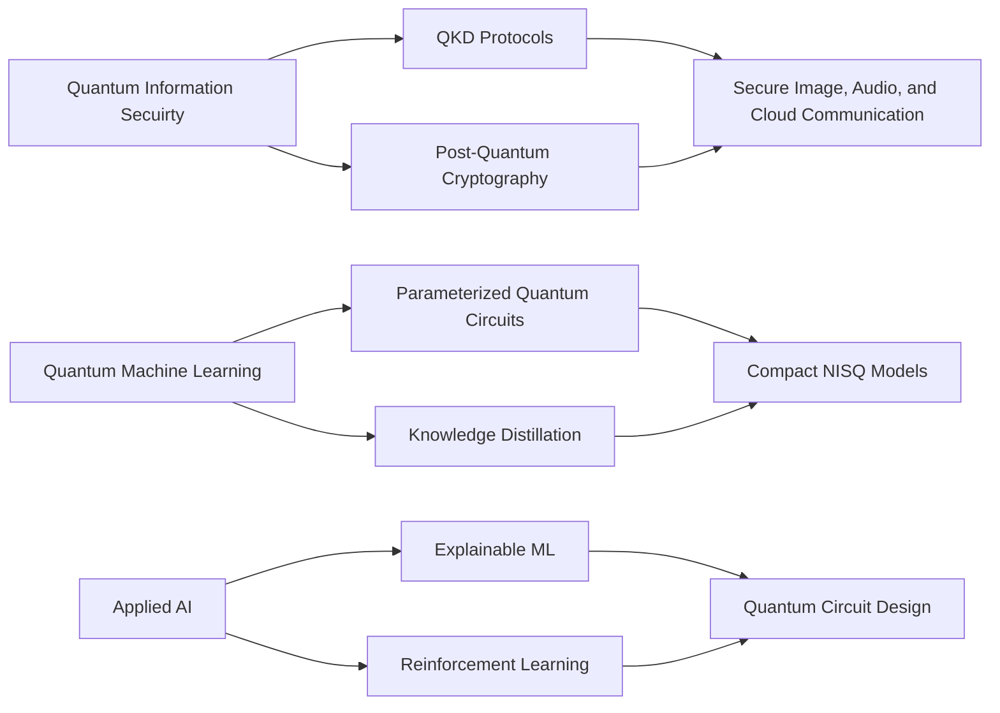
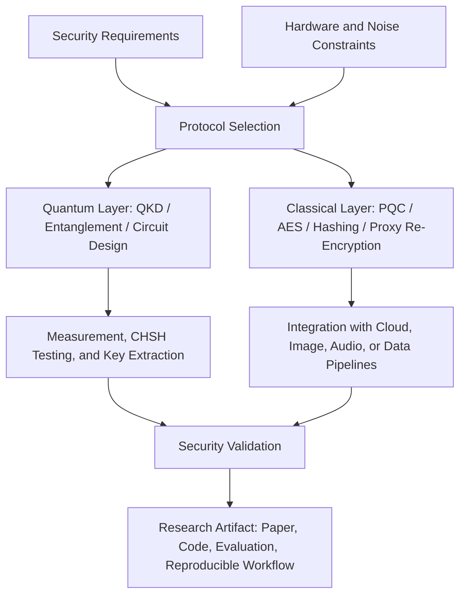

### Graduate Research Assistant, Department of Computer Science, Cleveland State University

I design and evaluate quantum-safe communication systems, hybrid quantum-classical algorithms, and applied AI pipelines for secure, practical, and measurable deployment.

---

## Research Snapshot

<table>
  <tr>
    <td align="center" width="25%">
       
      <strong>Publications</strong> 
      Quantum security, applied AI, and behavioral analytics.
    </td>
    <td align="center" width="25%">
       
      <strong>Research Impact</strong> 
      Active citation footprint across quantum-safe systems and ML.
    </td>
    <td align="center" width="25%">
       
      <strong>Current Role</strong> 
      Graduate Research Assistant at Cleveland State University.
    </td>
    <td align="center" width="25%">
       
      <strong>Research Focus</strong> 
      Quantum-safe cloud, secure communication, and NISQ-era learning.
    </td>
  </tr>
</table>

## Research Map

## Academic Focus

| Area | Methods I Use | Research Output |
|---|---|---|
| Quantum-safe communication | BB84, B92, E91, CHSH testing, AES-256, hashing, steganography | Secure image, audio, and cloud communication frameworks |
| Post-quantum cloud security | QKD, ML-KEM/Kyber, proxy re-encryption, hybrid key exchange | QuCloud architecture for protected cloud data sharing |
| Quantum machine learning | Qiskit, parameterized quantum circuits, QNN compression, distillation | Parameter-efficient QNNs with 16x parameter reduction |
| Applied AI | PyTorch, TensorFlow, Scikit-learn, NLP, XAI | Healthcare analytics, depression self-assessment, behavioral prediction |

## Selected Publications

| Year | Work | Venue | Link |
|---:|---|---|---|
| 2026 | QuCloud: Enhancing cloud storage security by combining QKD, PQC, and custom proxy re-encryption | Journal of Information Security and Applications |  |
| 2025 | Quantum Secure Image Transmission: A Chaos-Assisted QKD Approach Using Entanglement | IET Quantum Communication |  |
| 2025 | Multi-layered Security: Integrating QKD with Classical Cryptography to Enhance Steganographic Security | Alexandria Engineering Journal |  |
| 2025 | QSAC: Quantum-assisted Secure Audio Communication using Entanglement, Audio Steganography, and Classical Encryption | Engineering Science and Technology |  |
| 2024 | SAD: Self-Assessment of Depression for Bangladeshi University Students Using ML and NLP | Array |  |
| 2023 | Predictive Modeling of Consumer Purchase Behavior with TPB and Machine Learning | PLOS ONE |  |

## Project Gallery

  
  
  
  

## Research System Design

## Technical Stack

  
  
  
  
  
  
  
  

## GitHub Signal

  
  
  

## Current Directions

- Reinforcement learning for hybrid PQC/TLS negotiation under security and performance constraints.
- Parameter-efficient quantum neural networks for NISQ-era deployment.
- Quantum-safe cloud storage architectures with QKD, PQC, and proxy re-encryption.
- Applied AI and explainable machine learning for healthcare and decision support.

## Recent Highlights

| Date | Highlight |
|---|---|
| May 2026 | Reached 100+ Google Scholar citations across quantum security, applied AI, and ML research. |
| Jan 2026 | QuCloud published in Journal of Information Security and Applications. |
| Sep 2025 | Chaos-assisted QKD image transmission paper published in IET Quantum Communication. |
| Aug 2025 | Started PhD in Computer Science at Cleveland State University. |
| Aug 2025 | Quantum-assisted secure audio communication paper published in Engineering Science and Technology. |
| Jul 2025 | QKD-integrated steganographic security framework appeared in Alexandria Engineering Journal. |

---

<strong>Research motto:</strong> Build quantum-safe systems that are not only theoretically secure, but also measurable, reproducible, and useful in real deployment settings.

  

